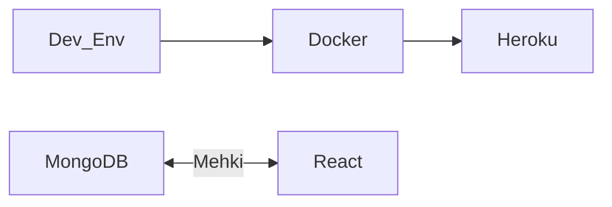

# TTFHW

### Prerequisites

    * Git and Git Bash
    * Node.js
    * Visual Studio Code

### Cloning into to your workspace

```

    git clone https://github.com/JohnLandtblom/Paketering---backend.git in your workspace


```

### Working with the project in VSCode

``` 

    Run this to get the necessary packages for the project to work
    npm install

    This starts the React project in your default browser
    npm start


    Navigate to /c/Users/<USERNAME>/wd/paketering---backend/src
    Write your Hello World and save. You will see the changes update in your browser automatically


```

# We are Mehki

Chat application run with React and MongoDB

### Packages

    * Node.js
    * Express.js
    * Nodemon
    * Cors
    * Mongoose
    * Path
    * Jest
    * Jest runner groups


### System Overhead



