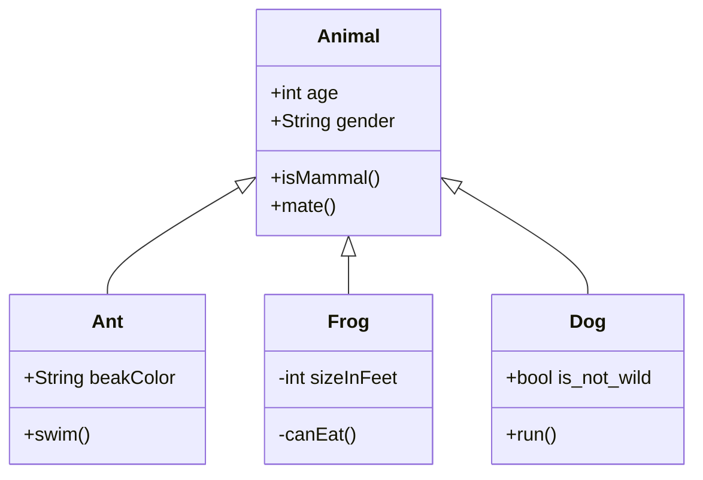
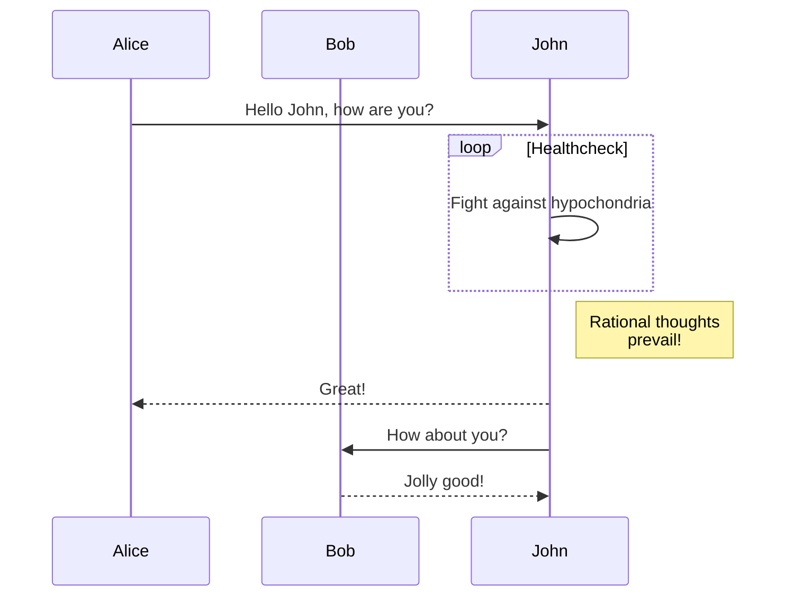
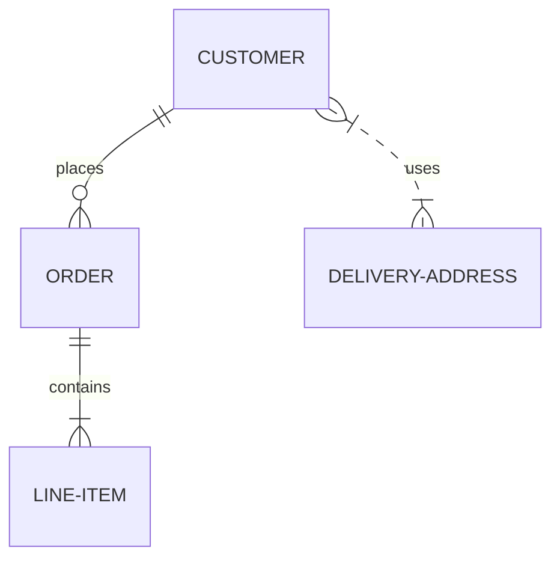

# Userstory-003.
### To add an image write this markdown code as following, replace the local image file with your filename.
### Example: 
###


# gruppgit


# UserStory-007

*John Was here*
**John left**

# UserStory-015  


This word is `highlighted`, this word is also `highlighted`. I like `highlighted` words.

# UserStory-013

# UserStory-006  


| Tables   |      Are      |  Cool |
|----------|:-------------:|------:|
| col 1 is |  left-aligned | $1600 |
| col 2 is |    centered   |   $12 |
| col 3 is | right-aligned |    $1 |


# user story 009:
You can create a horizontal break to divide your text by placing three (or more) underscores 

___

or asterisks 

"***"
***

or hyphens

"---"
----

on their own line.


# userstory 11
   > Markdown blockquote  
   > Blabla  
   > Blabla  


# Userstory 01

```js

let a = "Hello World;

```

# Userstory-002

```Java

class CodeBlock
{
    public static void main(String arg[])

    {
        System.out.println("In main block");
        
        {    // LINE A
            System.out.print("In ");
            System.out.print("inner ");
            System.out.print("block ");    // LINE A1
            System.out.println("One");
        }
        
        {    // LINE B
            System.out.print("In ");
            System.out.print("inner ");
            System.out.print("block ");
            System.out.println("Two");
        
            {    // LINE C
                System.out.println ("Block inside inner block two");
            }
        } // LINE D    
    }
 ```


extra: 
Userstory-019:
#### As a Devops,
#### I want to
#### Learn to code like a pro,
#### Have a Galeon 400 and
#### Maybe eat pizza every day.
##### ps. I'm low carb carnivore ;) 


# Userstory 05

[Google Search Engine](https://www.google.se/).

# Userstory 16


# Userstory 8 
 ocean man :joy: Emoticon 


 


# Userstory-010

### Ordered List

1. First item
2. Second item
3. Third item
    - Indented item
    - Indented item
4. Fourth item


# Userstory-012


